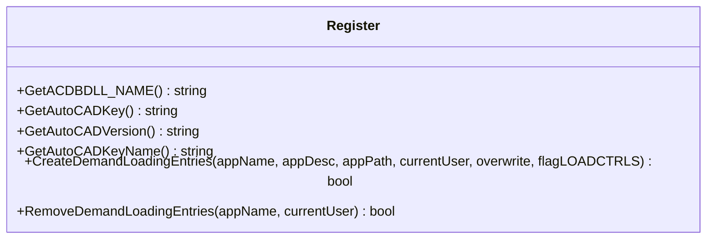
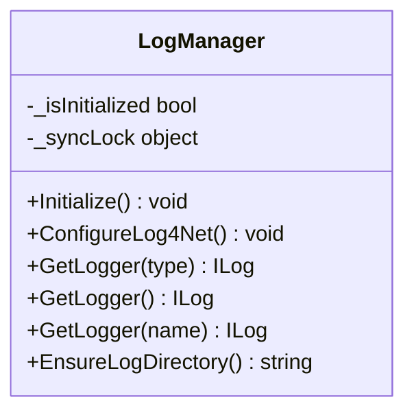
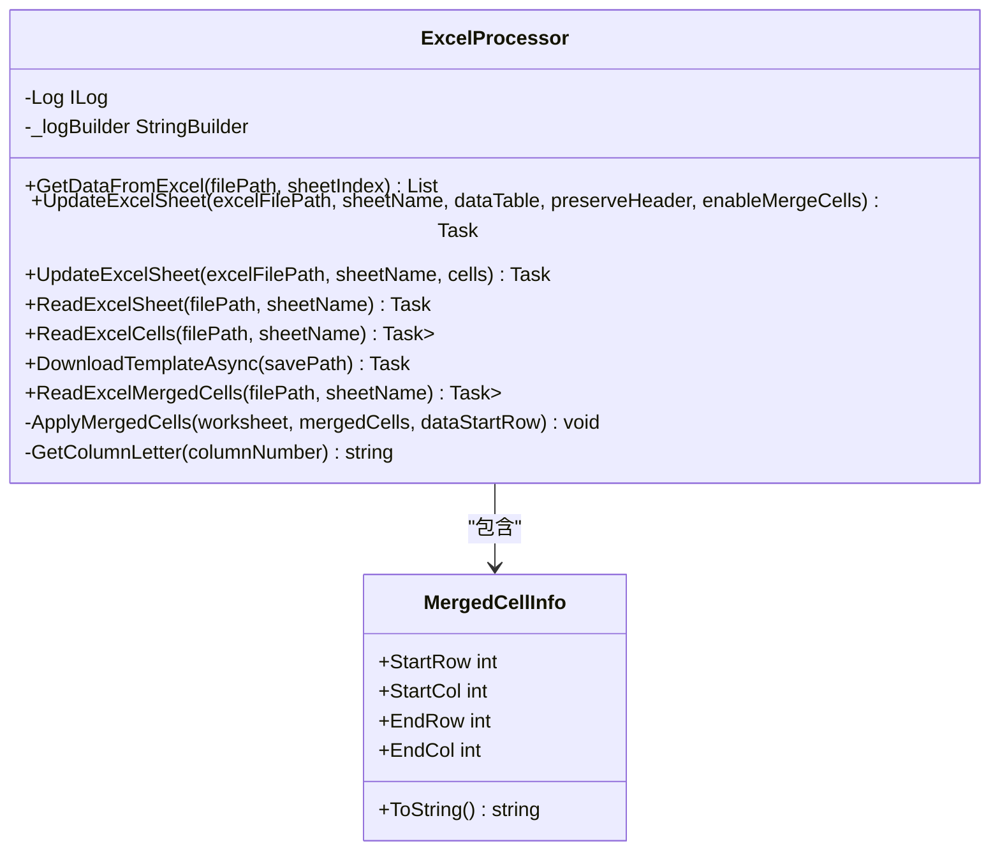
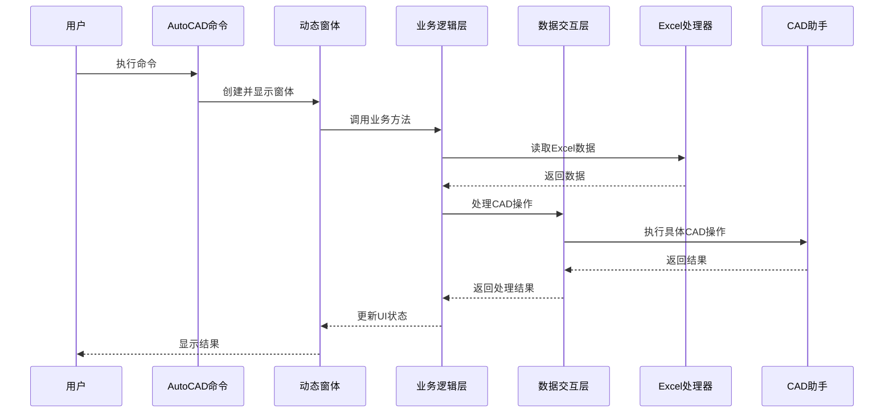

# 技术架构

<cite>
**本文档引用的文件**
- [Register.cs](file://WinformUI/CADHelper/Register.cs)
- [LogManager.cs](file://MyOffice/LogHelper/LogManager.cs)
- [ExcelProcessor.cs](file://MyOffice/ExcelProcessor.cs)
</cite>

## 目录
1. [分层设计模式](#分层设计模式)
2. [AutoCAD.NET插件加载机制](#autocadnet插件加载机制)
3. [动态窗体创建与管理](#动态窗体创建与管理)
4. [日志系统集成](#日志系统集成)
5. [Excel处理协作机制](#excel处理协作机制)
6. [关键调用链路分析](#关键调用链路分析)
7. [设计模式应用](#设计模式应用)
8. [技术债务分析](#技术债务分析)

## 分层设计模式

DCSDesign2025采用清晰的三层架构设计，分别为用户界面层（WinformUI）、业务逻辑层（MyOffice）和数据交互层（CADHelper）。这种分层设计实现了关注点分离，提高了代码的可维护性和可测试性。

UI层（WinformUI）负责提供用户交互界面，包含多个功能模块如UpdateFrameTag、UpdateTable和UpgradeProject。业务逻辑层（MyOffice）封装了核心业务规则和数据处理逻辑，包括ExcelProcessor、WordProcessor等组件。数据交互层（CADHelper）作为与AutoCAD进行交互的桥梁，提供了丰富的工具类来操作CAD文档。

各层之间通过明确定义的接口进行通信，确保了低耦合高内聚的设计原则。这种架构使得各个层次可以独立开发、测试和部署，同时也便于未来的功能扩展和技术升级。

**Section sources**
- [ExcelProcessor.cs](file://MyOffice/ExcelProcessor.cs#L14-L915)

## AutoCAD.NET插件加载机制

AutoCAD.NET SDK通过注册表机制实现插件的自动加载。`Register`类在`WinformUI.CADHelper`命名空间中提供了完整的注册表操作功能，用于配置AutoCAD的自动加载行为。

该机制的核心是`CreateDemandLoadingEntries`方法，它在Windows注册表中创建必要的键值来注册.NET程序集。当AutoCAD启动时，会读取这些注册表项并根据配置加载相应的插件。注册过程涉及获取当前AutoCAD版本信息，并在`HKEY_CURRENT_USER\Software\Autodesk\AutoCAD\[版本]\Applications`路径下创建应用程序条目。

注册表项包含多个关键属性：`DESCRIPTION`存储程序描述，`LOADER`指定程序集路径，`MANAGED`标志指示这是一个托管程序集，而`LOADCTRLS`控制加载时机。这种基于注册表的机制允许精确控制插件的加载策略，支持按需加载以优化性能。

**Diagram sources**
- [Register.cs](file://WinformUI/CADHelper/Register.cs#L8-L172)

**Section sources**
- [Register.cs](file://WinformUI/CADHelper/Register.cs#L8-L172)

## 动态窗体创建与管理

系统利用AutoCAD提供的`Application.ShowModelessDialog()`方法实现动态窗体的创建与显示。这种方法允许在AutoCAD环境中显示非模态对话框，使用户能够在与自定义窗体交互的同时继续操作AutoCAD主界面。

动态窗体的创建流程始于命令触发，通过AutoCAD命令系统调用相应的处理方法。然后实例化WinForm窗体对象，并使用`ShowModelessDialog`方法将其嵌入到AutoCAD界面中。这种方式保持了用户体验的一致性，同时提供了丰富的图形化操作界面。

窗体生命周期由AutoCAD应用程序管理，确保了资源的正确释放和内存泄漏的避免。通过事件驱动的方式，窗体可以响应用户输入并执行相应的业务逻辑，最后将结果反馈给AutoCAD环境。

## 日志系统集成

系统采用log4net作为日志框架，通过`LogManager`单例类在`MyOffice.LogHelper`命名空间中实现统一的日志管理。该日志系统为整个应用程序提供了一致的日志记录接口，支持多级别日志输出和灵活的配置选项。

`LogManager`类采用双重检查锁定模式确保线程安全的初始化。它配置了两个滚动文件追加器：一个用于记录所有级别的日志到`application.log`，另一个专门捕获错误和致命级别的日志到`error.log`。日志文件按日期和大小进行滚动，最多保留10个备份文件，每个文件最大5MB。

各模块通过`GetLogger<T>()`泛型方法获取类型特定的日志记录器，实现了细粒度的日志分类。日志目录自动创建于程序集所在位置的"logs"子目录中，确保了部署的便捷性。这种集中式的日志管理极大地简化了问题排查和系统监控。

**Diagram sources**
- [LogManager.cs](file://MyOffice/LogHelper/LogManager.cs#L15-L142)

**Section sources**
- [LogManager.cs](file://MyOffice/LogHelper/LogManager.cs#L15-L142)

## Excel处理协作机制

Excel处理功能通过`ExcelProcessor`类实现，该类整合了Aspose.Cells和EPPlus两种技术栈的优势。系统主要依赖EPPlus库进行Excel文件的操作，同时兼容Aspose.Cells的某些特性，形成了强大的电子表格处理能力。

`ExcelProcessor`提供了多种数据处理方法：`GetDataFromExcel<T>`从Excel读取数据并映射到泛型对象，支持通过属性名或DisplayName特性匹配列；`UpdateExcelSheet`重载方法支持基于DataTable或单元格列表更新工作表；`ReadExcelSheet`和`ReadExcelCells`分别用于读取表格数据和单元格内容。

特别值得注意的是，系统设置了`ExcelPackage.LicenseContext = OfficeOpenXml.LicenseContext.NonCommercial`，明确指定了非商业用途的许可证模式。对于复杂的表格结构，还实现了合并单元格的读取和应用功能，确保了与CAD图纸中复杂表格的精确对应。

**Diagram sources**
- [ExcelProcessor.cs](file://MyOffice/ExcelProcessor.cs#L14-L915)

**Section sources**
- [ExcelProcessor.cs](file://MyOffice/ExcelProcessor.cs#L14-L915)

## 关键调用链路分析

从命令触发到CAD文件处理的数据流动过程体现了系统的整体工作流程。以下序列图展示了这一关键调用链路：

**Diagram sources**
- [ExcelProcessor.cs](file://MyOffice/ExcelProcessor.cs#L14-L915)
- [Register.cs](file://WinformUI/CADHelper/Register.cs#L8-L172)

## 设计模式应用

系统广泛采用了多种设计模式以提高可维护性和扩展性。工厂模式体现在`ExcelProcessor`中对不同数据源的处理方法选择上，通过统一接口隐藏了具体的实现细节。门面模式通过`ExcelProcessor`类为复杂的Excel操作提供了简化的高层接口，降低了客户端使用的复杂度。

观察者模式的应用体现在日志系统中，`ILog`接口的实现允许不同的appender订阅日志事件，实现了松耦合的日志处理机制。单例模式在`LogManager`中的应用确保了全局唯一的日志配置和管理实例，避免了资源浪费和配置冲突。

这些设计模式的综合运用使得系统具有良好的开放封闭性，新功能可以相对容易地添加而不影响现有代码，同时也便于单元测试和模拟。

## 技术债务分析

系统存在一些潜在的技术债务需要关注。首先，注册表配置方式虽然有效但较为脆弱，容易受到权限限制和注册表清理工具的影响。建议考虑数字签名和证书验证等更现代的插件认证机制。

其次，系统缺乏依赖注入机制，导致组件间存在紧耦合。例如`ExcelProcessor`直接实例化log4net记录器，这不利于测试和替换日志框架。引入IoC容器可以显著改善这一点。

另外，配置信息分散在代码中（如`ExcelPackage.LicenseContext`），缺乏统一的配置管理。建议将这些设置集中到配置文件中，便于管理和调整。最后，异常处理虽然存在但不够完善，部分方法仅返回布尔值表示成功与否，丢失了详细的错误信息。

这些问题虽然不影响当前功能，但在长期维护和团队协作中可能成为瓶颈，建议在后续迭代中逐步解决。