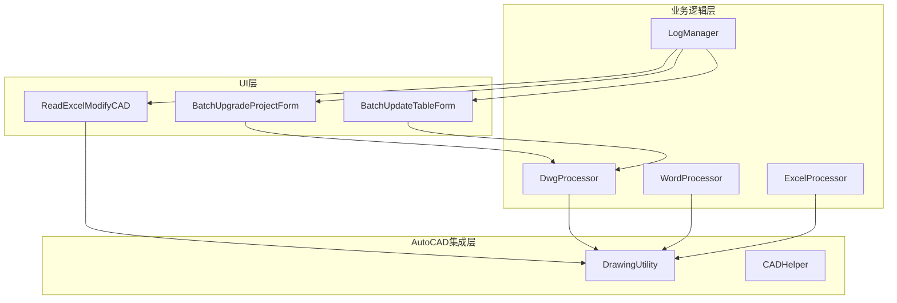
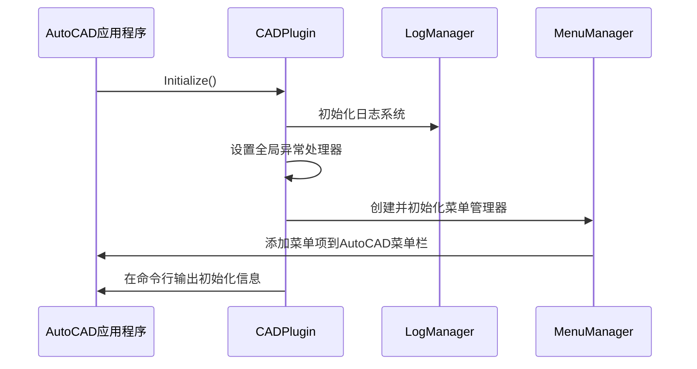

# 项目概述

<cite>
**本文档引用的文件**
- [CADPlugin.cs](file://CADPlugin.cs)
- [MenuManager.cs](file://MenuManager.cs)
- [BatchUpgradeProjectForm.Designer.cs](file://WinformUI/UpgradeProject/BatchUpgradeProjectForm.Designer.cs)
- [BatchUpgradeProjectForm.cs](file://WinformUI/UpgradeProject/BatchUpgradeProjectForm.cs)
- [CadProcessor.cs](file://WinformUI/UpgradeProject/CadProcessor.cs)
- [DrawingUtility.cs](file://WinformUI/CADHelper/DrawingUtility.cs)
- [LogManager.cs](file://MyOffice/LogHelper/LogManager.cs)
</cite>

## 目录
1. [引言](#引言)
2. [项目结构与核心目的](#项目结构与核心目的)
3. [系统架构分析](#系统架构分析)
4. [主入口与初始化流程](#主入口与初始化流程)
5. [菜单管理器实现](#菜单管理器实现)
6. [用户工作流与功能组件](#用户工作流与功能组件)
7. [设计模式应用](#设计模式应用)
8. [结论](#结论)

## 引言
DCSDesign2025是一个专为AutoCAD开发的插件，旨在自动化处理工程图纸中的重复性任务。该项目通过提供批量升级、表格更新和图框标记修改等功能，显著提升了设计效率。本文档将深入探讨其系统架构、核心组件以及技术实现细节，为初学者提供概念性引导，并为高级开发者详述关键技术的应用场景。

## 项目结构与核心目的
DCSDesign2025项目的目录结构清晰地划分了不同的功能模块：
- **InstallerPlugin**: 包含安装程序相关的代码。
- **MyOffice**: 提供日志记录（LogHelper）和Office文件处理（OfficeHelper）等通用服务。
- **WinformUI**: 实现用户界面，包括CAD集成工具（CADHelper）、批量修改框架（UpdateFrameTag）、批量更新表格（UpdateTable）和批量升级项目（UpgradeProject）。
- **CADPlugin.cs 和 MenuManager.cs**: 核心插件类和菜单管理器。

该项目的核心目的是作为AutoCAD插件，实现对工程图纸的自动化处理，具体功能包括：
- 批量升级工程图纸
- 批量更新表格内容
- 修改图框标记值

这些功能通过直观的WinForm用户界面进行操作，极大地减少了手动编辑的时间和错误率。

## 系统架构分析
DCSDesign2025采用分层架构设计，主要包括三个层次：UI层（WinformUI）、业务逻辑层（MyOffice）和AutoCAD集成层（CADHelper）。这种分层设计确保了各组件之间的职责分离，提高了系统的可维护性和扩展性。

**Diagram sources**
- [BatchUpgradeProjectForm.cs](file://WinformUI/UpgradeProject/BatchUpgradeProjectForm.cs)
- [CadProcessor.cs](file://WinformUI/UpgradeProject/CadProcessor.cs)
- [DrawingUtility.cs](file://WinformUI/CADHelper/DrawingUtility.cs)
- [LogManager.cs](file://MyOffice/LogHelper/LogManager.cs)

该架构中，UI层负责与用户交互并收集输入参数；业务逻辑层执行具体的处理任务，如文本替换、表格更新等；而AutoCAD集成层则提供了与AutoCAD API交互的底层支持，使得上层可以方便地操作DWG文件。

## 主入口与初始化流程
`CADPlugin` 类是整个插件的主入口点，实现了 `IExtensionApplication` 接口。当AutoCAD启动时，会调用其 `Initialize()` 方法来完成插件的初始化。

**Diagram sources**
- [CADPlugin.cs](file://CADPlugin.cs)
- [MenuManager.cs](file://MenuManager.cs)

在 `Initialize()` 方法中，首先初始化日志系统，然后设置全局异常处理器以捕获未处理的异常。接着创建 `MenuManager` 实例并调用其 `Initialize()` 方法来注册菜单和命令。最后，在AutoCAD命令行输出提示信息，告知用户插件